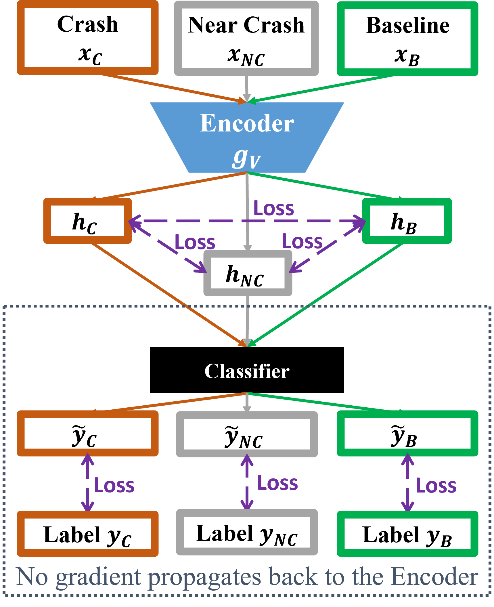

# SC4VR: Supervised Contrastive Learning for Video Representations

Official PyTorch implementation of [Enhancing vision representations for traffic safety-critical events via supervised contrastive learning](https://www.sciencedirect.com/science/article/pii/S0022437525001471#fig0015).

SC4VR is a novel approach designed to enhance video representation learning, specifically for crash and near-crash events. 

## Method Overview

<p align="center">
  
</p>


## Quickstart

### Installation

1. Clone the repository:
   ```bash
   git clone https://github.com/Boyu-J/SC4VR.git
   ```
   
2. Install dependencies:
   ```bash
   conda create -n sc4vr python=3.10
   conda activate sc4vr
   pip install -r requirements.txt
   ```

### Tutorial Notebook

The [Tutorial Notebook](Tutorial.ipynb) provides a step‑by‑step walkthrough of the SC4VR workflow, guiding users from raw data to validated results. What the Tutorial Covers:

- **Environment Setup**  
  Instructions for preparing the SC4VR environment.

- **Dataset Structure & Loading**  
  Demonstrates how to organize input data and load it into the pipeline.

- **Core Processing Pipeline**  
  Walks through the main SC4VR modules, showing how each component transforms the data.

- **Running the Model**  
  Example code for executing the full workflow, including configuration options and expected outputs.


## Citation

If you use this repository in your research, please cite the following:

```bibtex
@article{JIANG2025468,
title = {Enhancing vision representations for traffic safety-critical events via supervised contrastive learning},
journal = {Journal of Safety Research},
volume = {95},
pages = {468-475},
year = {2025},
issn = {0022-4375},
doi = {https://doi.org/10.1016/j.jsr.2025.10.002},
url = {https://www.sciencedirect.com/science/article/pii/S0022437525001471},
author = {Boyu Jiang and Liang Shi and Feng Guo}
}
```

## License

This project is licensed under the MIT License. See the [LICENSE](LICENSE) file for details.

